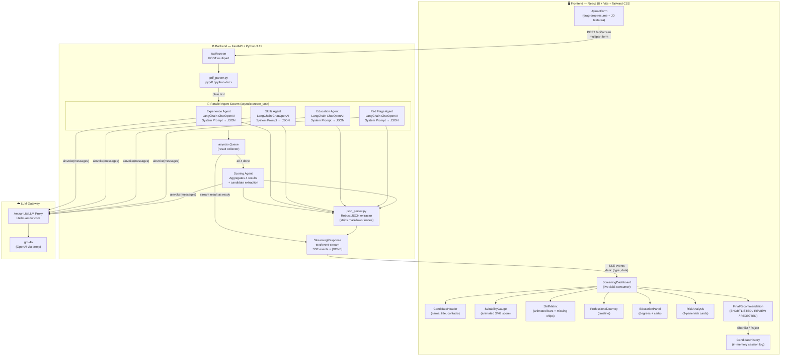

# Capstone Demo Guide — HR Tech: Resume Screening Swarm

---

## 1. Application Architecture Diagram



---

## 2. End-to-End Workflow Walkthrough (what to say on screen)

### Phase 1 — Upload Screen
> *"The recruiter lands on the upload screen. They drag and drop a PDF or DOCX resume — up to 5 MB — and paste a job description (500–3000 characters). I added client-side validation so the backend never receives bad input."*

**Demo step:** Drop a real resume PDF + paste a realistic JD → click **Screen Now**.

---

### Phase 2 — Live Screening (SSE stream)
> *"The moment the form is submitted, the backend fires 4 AI agents simultaneously using `asyncio.create_task()`. Each agent is a dedicated LangChain ChatOpenAI call with a strict system prompt. Results are pushed to the frontend via Server-Sent Events — the dashboard updates panel by panel as each agent completes, not all at once."*

**Point out on screen:**
- The progress bar ticking from 0/4 → 1/4 → 2/4 → 3/4 agents done
- Individual result cards appearing in real time

---

### Phase 3 — Final Results Dashboard
> *"Once all 4 agents report back, the Scoring Agent runs. It applies a weighted formula: 30 pts experience, 40 pts skills, 20 pts education, minus up to 10 pts for red flags. The SuitabilityGauge animates to the final score. The recommendation is either SHORTLISTED, REVIEW REQUIRED, or REJECTED based on the threshold bands."*

Walk through each panel:
1. **CandidateHeader** — name, title, email extracted by Scoring Agent
2. **SuitabilityGauge** — final score out of 100
3. **SkillMatrix** — animated bars per skill category + missing skills chips
4. **ProfessionalJourney** — work history timeline from Experience Agent
5. **EducationPanel** — every degree level (SSC → Master's) + certs
6. **RiskAnalysis** — tenure stability / skills authenticity / employment gaps

---

### Phase 4 — Decision & History
> *"The recruiter can Shortlist or Reject the candidate. On rejection, a modal asks for a reason and optional notes for audit trail. All decisions accumulate in the in-session Candidate History view."*

---

## 3. Code Walkthrough — Key Points Per File

### `backend/main.py`
- `screen_stream()` is the core async generator — explain `asyncio.Queue` pattern
- 4 `create_task()` calls fire agents concurrently; `queue.get()` yields results as they arrive
- `StreamingResponse` wraps the generator → `text/event-stream` content type
- File validation: MIME type check + 5 MB size guard before any LLM call

### `backend/agents/*.py` — Agent Pattern
All 5 agents share the same pattern — worth highlighting:
```
SYSTEM_PROMPT (strict JSON schema contract)
    ↓
ChatOpenAI.ainvoke([SystemMessage, HumanMessage])
    ↓
json_parser.parse_json_response()  ← strips markdown fences
    ↓
Typed dict returned to queue / caller
```
**Design decision:** Each agent has a *single responsibility* — no agent knows about others. The Scoring Agent is the only one that sees all results.

### `backend/utils/json_parser.py`
> *"LLMs sometimes wrap JSON in markdown fences. This utility strips them before `json.loads()` so the system never crashes on formatting differences — a critical reliability concern in production."*

### `backend/utils/pdf_parser.py`
> *"Supports both PDF (pypdf) and DOCX (python-docx). If a file has no extractable text, it raises a descriptive error rather than silently passing empty text to the LLM."*

### `frontend/App.jsx` — SSE Consumer
- Phase state machine: `upload → screening → complete`
- `fetch()` + `ReadableStream` + `TextDecoder` for SSE — no external library
- Each `data:` line parsed → dispatched to the correct state slice

### `frontend/src/components/`
| Component | What to say |
|---|---|
| `UploadForm.jsx` | Drag-and-drop, MIME + size validation, character counter for JD |
| `ScreeningDashboard.jsx` | SSE consumer layout, progress bar, conditional panel rendering |
| `SuitabilityGauge.jsx` | Pure SVG animation, no external chart library needed |
| `SkillMatrix.jsx` | CSS animation on bars; missing skills as styled chips |
| `RiskAnalysis.jsx` | Color-coded PASS/WARNING/FAIL badges |
| `CandidateHistory.jsx` | In-memory session history; shows shortlisted vs rejected |
| `RejectModal.jsx` | Structured rejection reasons for HR audit trail |

---

## 4. Frameworks, Tools & Techniques — Talking Points

### LangChain + LangChain-OpenAI
- Used as the **LLM orchestration layer** — manages message formatting, async invocation, and error propagation
- `ChatOpenAI` is configured with `base_url` pointing to the LiteLLM proxy — easy to swap model providers without code changes
- `temperature=0.1` — low randomness for deterministic, structured JSON output

### LiteLLM Proxy (Amzur gateway → gpt-4o)
- Acts as a **model gateway** — the backend never holds a raw OpenAI key; all calls route through the corporate proxy
- Swapping the model requires only a `.env` change — zero code changes

### asyncio Parallel Agent Swarm
- **Why not sequential?** Sequential would take 4× longer. Parallel cuts total LLM latency to ~max(individual_agent_time) instead of their sum
- `asyncio.Queue` is the coordination primitive — producers (agents) push results as they finish; the consumer streams them to the frontend in arrival order

### Server-Sent Events (SSE)
- **Why SSE over WebSockets?** One-directional push from server → client is all that's needed. SSE is simpler, HTTP/1.1 compatible, automatically reconnects, and works through proxies without configuration
- The frontend uses the native `fetch` API + `ReadableStream` — no socket.io or EventSource library needed

### Prompt Engineering Strategy
- **Strict schema contracts in system prompts** — each agent's system prompt specifies exact JSON field names, types, and value enums. This eliminates ambiguous LLM output and makes the frontend's data binding reliable
- `temperature=0.1` reinforces structured, consistent output
- `json_parser.py` is the safety net for the occasional markdown wrapper the model adds

### Resume Parsing
- **pypdf** for PDF text extraction — page-by-page, concatenated
- **python-docx** for DOCX paragraph extraction
- File type validated at the API boundary (MIME type + file extension) to prevent processing garbage

---

## 5. Scoring Formula (show on screen)

$$
\text{Final Score} = \underbrace{E}_{\text{0–30}} + \underbrace{S}_{\text{0–40}} + \underbrace{Ed}_{\text{0–20}} + \underbrace{R}_{\text{−10 to 0}}
$$

| Component | Weight | Source Agent |
|---|---|---|
| Experience (`alignment_score` × 3) | 0–30 pts | Experience Agent |
| Skills (`match_percentage` × 0.4) | 0–40 pts | Skills Agent |
| Education (PASS=20, FAIL=0–15) | 0–20 pts | Education Agent |
| Red Flags (Low=0, Med=−5, High=−10) | −10–0 pts | Red Flags Agent |

| Final Score | Recommendation | Color |
|---|---|---|
| 90–100 | **SHORTLISTED** | Emerald green |
| 70–89 | **REVIEW REQUIRED** | Amber |
| 0–69 | **REJECTED** | Red |

---

## 6. Pre-Demo Checklist

- [ ] `.env` file present in `capstone/backend/` with valid `LITELLM_API_KEY`
- [ ] Backend running: `cd capstone/backend && uvicorn main:app --reload --port 8000`
- [ ] Frontend running: `cd capstone/frontend && npm run dev` → http://localhost:5174
- [ ] Have a real PDF resume ready (3–5 pages ideal for a rich demo)
- [ ] Have a job description ready (paste below):

**Sample JD to use in demo:**
```
We are looking for a Senior Software Engineer with 5+ years of experience in
Python, FastAPI, and cloud infrastructure (AWS or Azure). The ideal candidate
has hands-on experience with microservices architecture, Docker, Kubernetes,
and CI/CD pipelines. A Bachelor's degree in Computer Science or related field
is required. Strong communication skills and experience leading technical teams
are a plus.
```

---

## 7. Anticipated Q&A

**Q: Why not use LangGraph for the agent orchestration?**
> The swarm is a fixed fan-out → fan-in pattern (4 independent agents → 1 aggregator). LangGraph shines for dynamic graphs with conditional routing. Using plain `asyncio` keeps the code simpler and the dependency footprint smaller for this use case.

**Q: How does the frontend know when all agents are done?**
> The backend sends `data: [DONE]` as the final SSE frame. The frontend listens for this sentinel and transitions the phase state machine from `screening` to `complete`.

**Q: What happens if an agent fails?**
> The `run_and_enqueue` wrapper catches any exception and enqueues `{"error": str(exc)}` instead of crashing. The other agents continue. The Scoring Agent receives whatever partial data is available.

**Q: Is the candidate history persisted to a database?**
> Currently in-memory state in React — it clears on page refresh. Adding a backend `POST /api/candidates` endpoint and a SQLite/PostgreSQL table would be the natural next step.

**Q: Why SSE instead of polling?**
> Polling introduces artificial latency — you poll every N seconds and may miss results or add unnecessary delay. SSE pushes results the instant they arrive, giving a true real-time user experience.

**Q: How are prompt injections prevented?**
> Resume text is passed as `HumanMessage` content inside a structured prompt — not interpolated into the system prompt. The system prompt is hardcoded and never influenced by user input, mitigating prompt injection risk.
